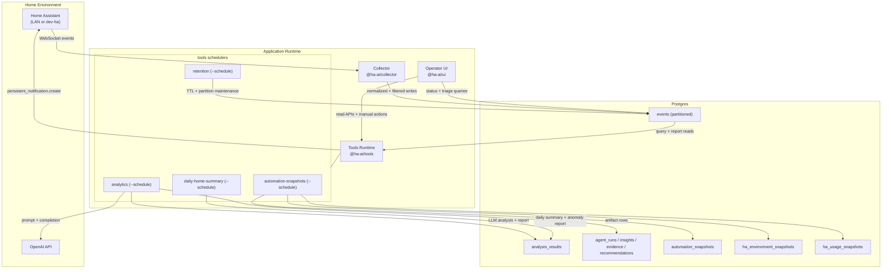

# Home Assistant AI Analyzer

Monorepo for collecting Home Assistant events into Postgres and generating analysis artifacts from that data.

## Architecture



## Overview

This project has three runtime components:

- Collector (`@ha-ai/collector`): subscribes to Home Assistant websocket events and ingests normalized records into Postgres.
- Tools (`@ha-ai/tools`): provides query tools (summary, top changes, context tracing, timelines, correlations, automation snapshots/listing) and an LLM analysis job that writes `agent_runs`, `insights`, `evidence`, `recommendations`, and `analysis_results`.
  - includes an automation snapshot sync scheduler where `automation`, `script`, `scene`, and blueprint context rows are captured into `automation_snapshots`.
  - captures current Home Assistant entity states into `entity_snapshots` for UI entity-state inspection.
  - Home Assistant environment inventory rows (`device`, `service`, `integration`, `addon`) are captured into `ha_environment_snapshots`.
  - utility usage snapshots (`energy`, `water`, `gas`, `power`) are captured into `ha_usage_snapshots` and passed into analysis agents; only numeric meter-like readings are persisted.
  - recommendation persistence requires valid `related_insight_rank` linkage; rows that cannot be mapped to an inserted insight rank are dropped from `recommendations` and recorded in run metadata.
  - automation/scene config snapshot extraction should use Home Assistant config IDs from `attributes.id` when available, and normalize singular/plural config keys (`trigger`/`triggers`, `action`/`actions`, `condition`/`conditions`).
  - analytics runs can publish a Home Assistant `persistent_notification` with a human-readable summary for each completed LLM analysis pass.
  - includes a separate daily-home-summary agent that compares daily activity to prior days, flags anomalies, persists a report, and posts a Home Assistant notification.
- UI (`@ha-ai/ui`): LAN-only operator console served by Fastify + React for health visibility, runs/recommendation triage, report/event views, and manual one-shot action triggers.
  - UI-triggered manual actions run on the server side and require `HA_WS_URL`, `HA_TOKEN`, and (for LLM runs) `OPENAI_API_KEY` in the `ui` service environment.
  - Events table filters are case-insensitive and trimmed, and payload preview closes automatically when a selected row is filtered out.
  - Table-heavy routes should remain mobile-safe: avoid page-level horizontal overflow and keep wide content scrollable inside route-local containers.
  - Snapshot Explorer route (`/snapshots`) provides direct visibility into latest automation, blueprint, script, and entity snapshot state from Postgres.

Collector ingest defaults include noise suppression for Home Assistant event spam:
- drop `state_changed` records where `old_state.state` equals `new_state.state`
- keep `binary_sensor` motion records only for `off -> on` transitions
- enrich `call_service.entity_id` from `service_data.device_id` / `target.device_id` using HA entity registry mappings when direct `entity_id` is missing
- normalize `EVENT_TYPES`, `DOMAIN_ALLOWLIST`, and `DOMAIN_EXCLUDELIST` values case-insensitively (quote/whitespace tolerant) before filtering

## Repository Layout

- `collector/` collector package
- `tools/` analytics and LLM package
- `ui/` operator dashboard package
- `schema/` baseline SQL bootstrap (`001_init.sql`)
- `scripts/` local development scripts
- `docker-compose.yml` local containers and profiles
- `docker-compose.prod.yml` Proxmox production stack
- `ops/proxmox/` bootstrap/deploy/rollback/backup automation
- `docs/architecture.md` runtime architecture
- `docs/data-contracts.md` table and tool contracts
- `docs/capability-matrix.md` implemented vs stubbed tools

## Package Documentation

For package-specific commands, environment variables, and troubleshooting:

- `collector/README.md`
- `tools/README.md`
- `ui/README.md`

## Onboarding Guides

- LAN Home Assistant onboarding: `docs/onboarding-lan.md`
- Proxmox production deployment: `docs/deploy-proxmox.md`

## Runtime Prerequisites

- Node.js 24
- Yarn 4 (via Corepack)
- Docker + Docker Compose
- Bash 5+ for local helper scripts in `scripts/`

## Quick Start (Project Level)

1. Install dependencies:

```bash
yarn install
```

2. Create local env file:

```bash
cp .env.example .env
```

`yarn dev:collector` reads values from repo-root `.env` automatically.

3. Start local DB services:

```bash
yarn dev:db:up
```

Retention scheduler and automation snapshot scheduler start automatically when `yarn dev:collector` starts.
pgAdmin defaults come from `.env` (`PGADMIN_DEFAULT_EMAIL`, `PGADMIN_DEFAULT_PASSWORD`) and the registered `ha_ai_postgres` server reuses your configured DB password.

4. Run collector locally (choose mode):

```bash
yarn dev:collector --mode=lan
# or
yarn dev:collector --mode=dev-ha
```

5. Run one analysis pass:

```bash
OPENAI_API_KEY='<token>' yarn start:analysis:once
```

6. (Optional) Start local operator UI:

```bash
yarn dev:ui:up
# then open http://127.0.0.1:5080
```

`yarn dev:ui:up` rebuilds and force-recreates the UI container so fresh web assets (for example favicon updates) are served immediately.

## Root Commands

From `/Users/bob/code/homeassistant/ha_ai_analyzer`:

```bash
yarn build
yarn test
yarn verify
yarn lint
yarn format
yarn lint:type
yarn up "*@latest"
yarn workspace @ha-ai/collector up "*@latest"
yarn workspace @ha-ai/tools up "*@latest"
yarn workspace @ha-ai/ui up "*@latest"
yarn test:integration
yarn test:integration:collector
yarn test:integration:tools
yarn dev:db:up
yarn dev:down
yarn dev:collector --mode=lan
yarn dev:collector --mode=dev-ha
yarn dev:ui:up
yarn dev:ui:logs
yarn start:collector
yarn start:ui
yarn start:analytics
yarn start:automation-snapshots
yarn start:daily-home-summary
yarn start:retention --once
yarn start:automation-snapshots:once
yarn start:automation-snapshots:scheduler
yarn start:daily-home-summary:once
yarn start:daily-home-summary:scheduler
yarn start:analysis:once
yarn start:analysis:scheduler
```

## CI and Dependency Automation

- CI workflow: `.github/workflows/ci.yml`
  - `verify` job runs `yarn verify`
  - `integration-tests` runs DB-backed suites with Postgres 18
  - `publish-pr-image` builds and publishes PR test images to GHCR with tags `pr-<number>-sha-<sha>` (same-repo PRs only)
- Dependabot config: `.github/dependabot.yml`
- Dependabot auto-merge workflow: `.github/workflows/dependabot-automerge.yml`

## Local Data Lifecycle

- Bring up local services: `yarn dev:db:up`
- Tear down local services and volumes across active profiles: `yarn dev:down`
- Baseline schema is applied from `schema/001_init.sql` on fresh Postgres volume initialization.

## Production Deployment (Proxmox Debian 13 VM)

- Production compose file: `/Users/bob/code/homeassistant/ha_ai_analyzer/docker-compose.prod.yml`
- Production env template: `/Users/bob/code/homeassistant/ha_ai_analyzer/.env.prod.example`
- VM operations scripts: `/Users/bob/code/homeassistant/ha_ai_analyzer/ops/proxmox/`
  - `/Users/bob/code/homeassistant/ha_ai_analyzer/ops/proxmox/bootstrap.sh`
  - `/Users/bob/code/homeassistant/ha_ai_analyzer/ops/proxmox/deploy.sh`
  - `/Users/bob/code/homeassistant/ha_ai_analyzer/ops/proxmox/rollback.sh`
  - `/Users/bob/code/homeassistant/ha_ai_analyzer/ops/proxmox/backup-db.sh`
- CI image publish workflow: `/Users/bob/code/homeassistant/ha_ai_analyzer/.github/workflows/publish-image.yml`

See `/Users/bob/code/homeassistant/ha_ai_analyzer/docs/deploy-proxmox.md` for full setup, update, rollback, and backup instructions.

Deployment scripts now include stale Docker network auto-recovery (`network ... not found`) by recreating compose networking/containers without deleting volumes.
