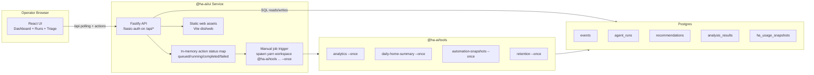

# UI Package (`@ha-ai/ui`)

Operator console for the HA AI Analyzer stack.

- Backend: Fastify API (`/api/*`) with HTTP basic auth.
- Frontend: React + Vite dashboard (polling every 10s by default).
- Runtime: served by the same process/container.

## Architecture



## API Surface

Protected by HTTP basic auth (`UI_BASIC_AUTH_USERNAME` / `UI_BASIC_AUTH_PASSWORD`):

- `GET /api/overview`
- `GET /api/runs`
- `GET /api/recommendations`
- `GET /api/reports/latest`
- `GET /api/events/recent`
- `GET /api/anomalies/recent`
- `GET /api/resource-usage/latest`
- `GET /api/snapshots/automations/current`
- `GET /api/snapshots/environment/current`
- `GET /api/snapshots/entities/current`
- `GET /api/health`
- `POST /api/actions/run-analysis`
- `POST /api/actions/run-daily-summary`
- `POST /api/actions/run-automation-snapshots`
- `POST /api/actions/run-retention`
- `GET /api/actions/:id`
- `PATCH /api/recommendations/:id`

Snapshot source mapping:
- `GET /api/snapshots/environment/current?type=automation|script|scene|blueprint` reads from `automation_snapshots`.
- `GET /api/snapshots/environment/current?type=device|service|integration|addon` reads from `ha_environment_snapshots`.
- `GET /api/snapshots/entities/current` reads from `entity_snapshots`.

## Scripts

From repo root:

```bash
yarn workspace @ha-ai/ui build
yarn workspace @ha-ai/ui lint:type
yarn workspace @ha-ai/ui test
yarn workspace @ha-ai/ui start:ui
```

## Environment

Required:

- `DATABASE_URL`
- `UI_BASIC_AUTH_USERNAME`
- `UI_BASIC_AUTH_PASSWORD`

Optional:

- `UI_HOST` (default `0.0.0.0`)
- `UI_PORT` (default `5080`)
- `UI_ACTION_STATUS_TTL_SECONDS` (default `900`)
- `UI_DEFAULT_POLL_INTERVAL_MS` (default `10000`)
- `UI_BUILD_VERSION` (default `dev`)
- `UI_WORKSPACE_ROOT` (default current working directory)
- `UI_YARN_BIN` (default `yarn`)
